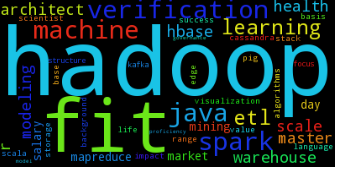

# Scraping Dice.com for Insights on Data Science Job Postings
This project scraped Dice.com to find the most frequently occuring words in job postings. 

## Methodology
The methodology was as follows:

1) Scrape data science job postings on Dice.com using Beautiful Soup
2) Build a TF-IDF model to identify most frequent keywords

While this seemed like a reasonable approach, it was quite clear that the keywords from this approach were dominated by domain-insenstive keywords. For example, almost every job posting at the end has a sentence similar to the following:

"______ is an equal opportunity employer. All qualified applicants will receive consideration for employment without regard to race, religion, color national origin, sex, age status as a protected veteran, or status as a qualified individual with disability."

These common keywords like race, religion etc. were dominating the analysis. To remove these, I found the most frequently occuring keywords across all fields (not just data science). I then eliminated these keywords and ranked the remaining data science keywords.

So the final methodology was as follows:

1) Scrape data science job postings on Dice.com using Beautiful Soup
2) Build a TF-IDF model to identify most frequent keywords
3) Scrape job postings from **any field** on Dice.com using Beautiful Soup
4) Build a TF-IDF model to identify most frequent keywords
5) Remove words in step 4 from step 2 and identify most frequent keywords

## Final Result

